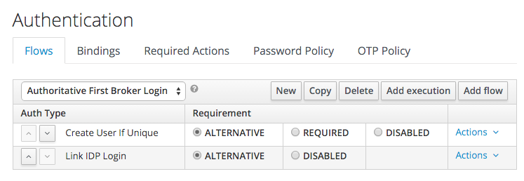

# Keycloak: Link IdP Login with User Provider

When using an external identity provider, Keycloak will, by default, ask
the user if they would like to link their IdP login with an existing account,
if one exists. When the external identity provider is an enterprise
SSO solution linked to an enterprise user directory with which Keycloak
is federated, these additional prompts are undesirable and confusing to
users. This small authentication provider can be dropped into a flow to
automatically link an IdP login with an existing user, federated or otherwise,
without prompting the user.

## Usage
1. Download a release jar or build with maven: `mvn package`.
2. Drop the jar into one of the directories defined in the `providers`
   element of `standalone/configuration/keycloak-server.json`.
3. Create or modify an Authentication flow to include the new `Link IDP Login`
   provider in the appropriate place.
4. Modify an Identity Provider to use the above flow.

## Example

Typically, you'll want a simple flow that starts with `Create User if Unique`
and continues to `Link IDP Login`, both of which should be alternative.

## License

* [Apache License, Version 2.0](https://www.apache.org/licenses/LICENSE-2.0)